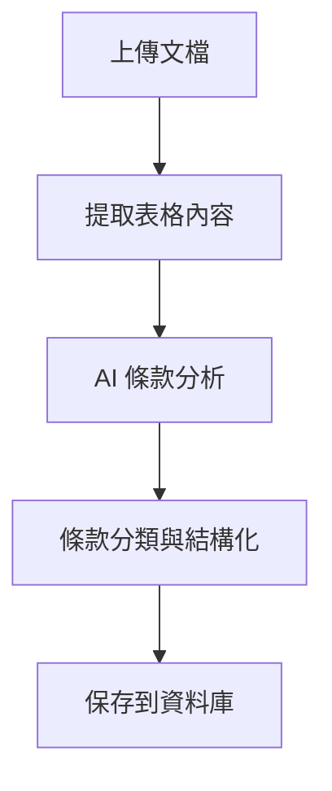

## 📋 專案概述 時間: 2025/7/28 09:30

**核心目標**: 建立智能化的銀行法務條款比對與差異分析系統

**業務需求核心**：
> "找相同的地方，相同的就直接填入條款書，不同的把它驗出來，去觀察『為什麼不同』，根據觀察到的不同原因，去做刪減或增加。"

## 🗂️ 專案架構分析

### 1. **真實業務文檔**（`原始文檔/`）
你有 6 個真實的銀行業務文檔：
- **批覆書**：銀行對授信申請的核准文件
- **授信條件約定書**：詳細的授信合約條件

這些分為兩個編號（大企業和商業金融），包含信用和擔保兩種類型。

### 2. **後端架構**（基於 FastAPI + LangGraph）

#### **核心技術棧**：
- **LangGraph**：工作流管理和狀態控制
- **Google Gemini 2.5**：AI 條款分析
- **SQLite**：資料存儲
- **FastAPI**：Web API 框架

#### **主要代碼文件解析**：

**`graph.py`** - LangGraph 工作流核心：
```python
# 三個主要節點：
1. read_document_tables()  # 從 docx 表格提取內容
2. extract_clauses()       # 使用 LLM 提取條款
3. save_clauses_to_db()    # 保存到資料庫
```

**`llm.py`** - Gemini API 整合：
```python
# 使用 Gemini 2.5 Flash 進行條款提取
# 定義了 7 大條款類別：
- 授信種類及額度
- 利費率  
- 期限
- 還本付息
- 連帶保證人
- 擔保品
- 特約條件
```

**`schemas.py`** - 資料結構定義：
```python
# 定義了完整的資料模型
ClauseCategory # 條款分類枚舉
RiskLevel      # 風險等級
ExtractedClause # 提取的條款結構
```

**`models.py`** - 資料庫模型：
```python
Case        # 案件表
Clause      # 條款表  
Comparison  # 比對歷史表
```

## 🔄 目前的工作流程



## ⚡ 當前功能狀態

### ✅ **已實現**：
1. **文檔解析**：能從 docx 表格提取內容
2. **AI 條款提取**：使用 Gemini 分析條款
3. **條款分類**：按 7 大類別自動分類
4. **資料庫儲存**：完整的 ORM 模型
5. **API 框架**：基礎的 FastAPI 端點

### 🚧 **待完成**：
1. **條款比對邏輯**：新案件 vs 歷史案件比較
2. **差異分析**：識別相同、相似、不同的條款
3. **智能建議**：根據差異生成行動建議
4. **前端介面**：React 用戶界面
5. **報告生成**：Word/PDF 輸出

## 🎯 核心業務邏輯

### **條款分析流程**：
1. **提取** → 從文檔中識別所有條款
2. **標準化** → 轉換為參數化模板
3. **比對** → 與歷史案件條款比較
4. **分析** → 找出差異原因（風險、法規、客戶特性等）
5. **建議** → 生成具體的法務操作建議

### **差異分析邏輯**：
```python
# 參數差異：金額、利率、期限變化
# 結構差異：條款有無、格式變化  
# 風險差異：擔保要求、限制條件

# 建議生成：
if 條款相同: "直接使用"
if 輕微差異: "需要審核" 
if 重大差異: "建議修改"
if 缺少條款: "考慮新增"
```

## 📊 技術特點

### **優勢**：
1. **真實業務場景**：基於實際銀行文檔開發
2. **智能化分析**：結合 AI 和業務邏輯
3. **工作流管理**：使用 LangGraph 確保流程可控
4. **可擴展架構**：模組化設計便於維護

### **技術挑戰**：
1. **精確度要求**：銀行業務不容錯誤
2. **複雜業務邏輯**：需要深度理解法務流程
3. **多文檔格式**：表格結構複雜
4. **風險評估**：需要專業的金融知識

## 🚀 下一步開發重點

### **Phase 1: 完善核心功能**
- 實現條款比對算法
- 加入歷史案件載入邏輯
- 完善差異分析引擎

### **Phase 2: 用戶界面**
- 開發 React 前端
- 實現條款比對視覺化
- 建立審核確認介面

### **Phase 3: 進階功能**
- 智能建議生成
- 報告導出功能
- 批次處理能力

這是一個非常有實用價值的專案，結合了現代 AI 技術和實際的銀行業務需求。你的技術架構選擇很好，LangGraph + Gemini 的組合特別適合這種需要多步驟分析的複雜業務流程。


時間: 2025/7/28 12:23

# 金融合約條款結構化分析改進建議

## 現有架構評估

### ✅ 優點
- **分類體系完整**：涵蓋信用額度、利率、期限、還款、擔保等核心要素
- **模板化設計**：standardized_text + parameters 架構便於重複使用
- **風險分級**：提供風險評估維度
- **結構化程度高**：成功從自然語言轉換為結構化數據

### 🔧 改進建議

### ✅ 做得很好的部分：

- 分類準確性：ClauseCategory分類很清晰，涵蓋了合約的核心要素
- 參數化設計：standardized_text + parameters的設計很聰明，可以重複使用模板
- 風險評估：RiskLevel分級有助於後續風險管控
- 結構化程度高：從非結構化文本成功提取出關鍵參數

### 💡 可以改進的地方：

#### 1. 金額格式統一：

- 現在："500,000仟元"
- 建議：分離數值和單位，如 "amount_value": 500000, "amount_unit": "千元"


#### 2. 日期格式標準化：

- 現在："2024年7月底"
- 建議："2024-07-31" (ISO格式)


#### 3. 風險等級邏輯：

- 擔保人和擔保品都是MEDIUM，但邏輯上"無擔保品"風險應該更高？


#### 4. 特殊條件整合：

- 多個SPECIAL_CONDITIONS可以考慮合併或建立子分類

#### 5. 數據格式優化
```json
// 現在
"amount_a_value": "500,000仟元"

// 建議
"amount_a_value": 500000,
"amount_a_unit": "千元",
"amount_a_currency": "TWD"
```

#### 6. 風險評估邏輯重新設計
```json
// 建議的風險評估維度
"risk_assessment": {
    "collateral_risk": "HIGH",  // 無擔保品
    "guarantor_risk": "MEDIUM", // 有保證人
    "amount_risk": "LOW",       // 金額適中
    "overall_risk": "MEDIUM"
}
```

#### 7. 增加法規合規檢查
```json
"compliance_check": {
    "regulatory_requirements": ["銀行法第33條", "授信準則第15條"],
    "compliance_status": "PASS",
    "exceptions": []
}
```

#### 8. 條款關聯性分析
```json
"clause_relationships": {
    "dependent_clauses": ["INTEREST_RATE", "TERM"],
    "conflicting_clauses": [],
    "missing_standard_clauses": ["違約條款", "提前償還條款"]
}
```